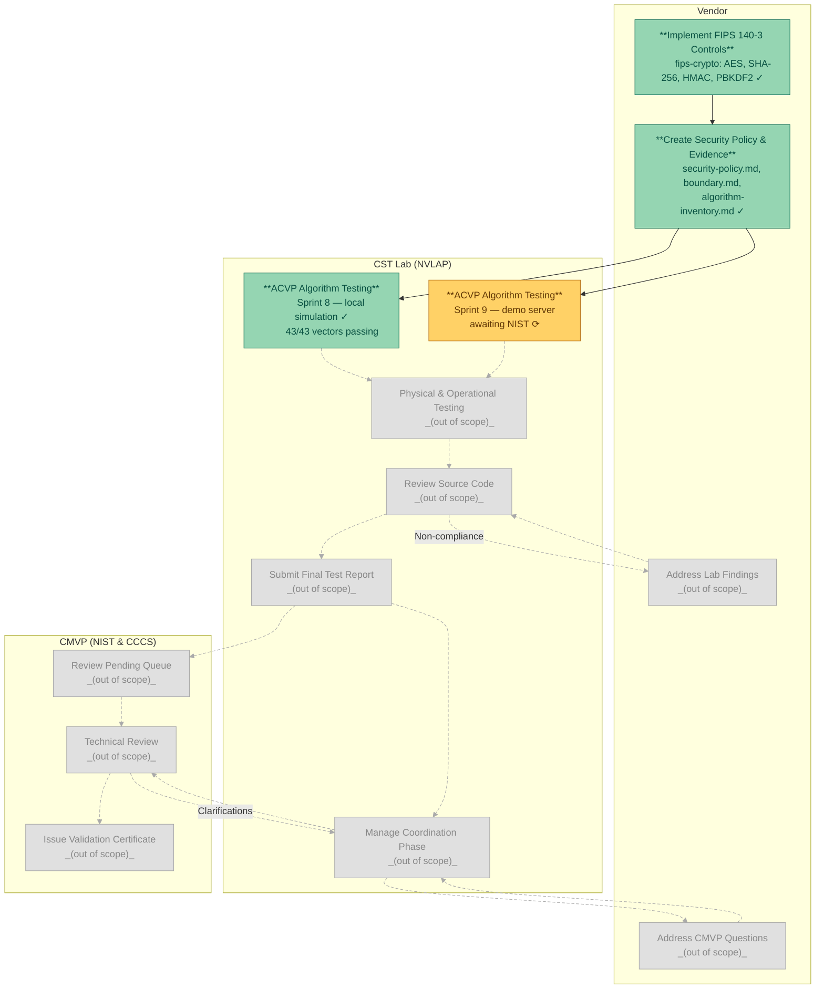

# CMVP Certification Process

This document shows the end-to-end path from implementation to a FIPS 140-3
validation certificate, and maps the work done in this project onto that path.

---

---

## Legend

| Style | Meaning |
|---|---|
| Green node | Complete in this project |
| Amber node | In progress in this project |
| Grey node (dashed edges) | Out of scope — requires an accredited NVLAP lab and CMVP engagement |

---

## Where this project fits

This project covers the first two vendor steps and the first CST Lab step:

- **V1 — Implement FIPS 140-3 Controls**: the `fips-crypto` C library with
  AES-128/256-CBC, SHA-256, HMAC-SHA-256, PBKDF2-HMAC-SHA-256, self-tests,
  and FIPS mode flag. Sprints 1–6 complete, 54/54 unit tests passing.

- **V2 — Create Security Policy & Evidence**: `docs/security-policy.md`
  structured to SP 800-140Br1 Annex B (B.2.1–B.2.12), `docs/boundary.md`,
  and `docs/algorithm-inventory.md`. NSP Alignment Sprint complete.

- **L1a — ACVP Algorithm Testing (local simulation)**: Sprint 8 complete.
  43/43 ACVP-format vectors passing across all four algorithms using a
  Python-harness / C-runner pipeline.

- **L1b — ACVP Algorithm Testing (demo server)**: Sprint 9 in progress.
  Awaiting NIST ACVTS demo server credentials to submit vectors to
  `demo.acvts.nist.gov` and obtain an authoritative disposition.

Everything from L2 onward requires engagement with an accredited Cryptographic
Security Testing (CST) laboratory under NVLAP, and is outside the scope of
this reference implementation.

---

**Navigation:** [Documentation Index](../README.md) · [ACVP Integration Workflow](acvp/integration.md) · [Security Policy](security-policy.md)
